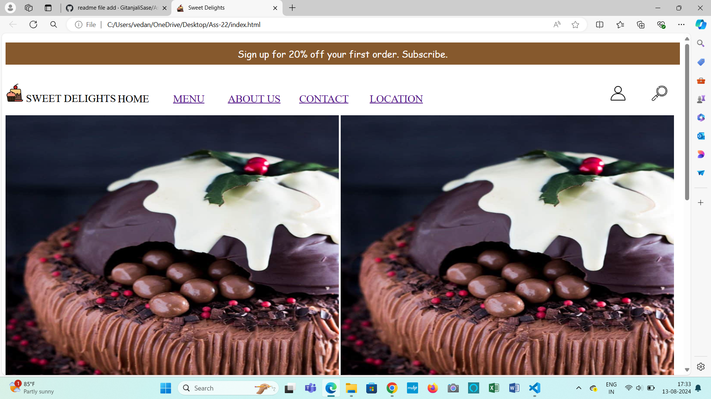
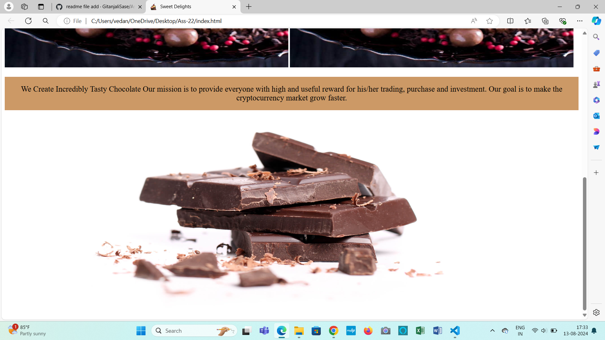
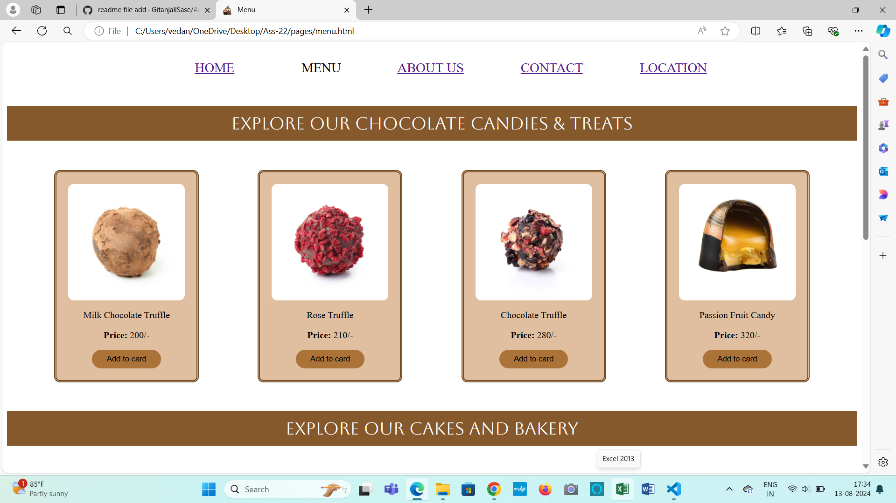
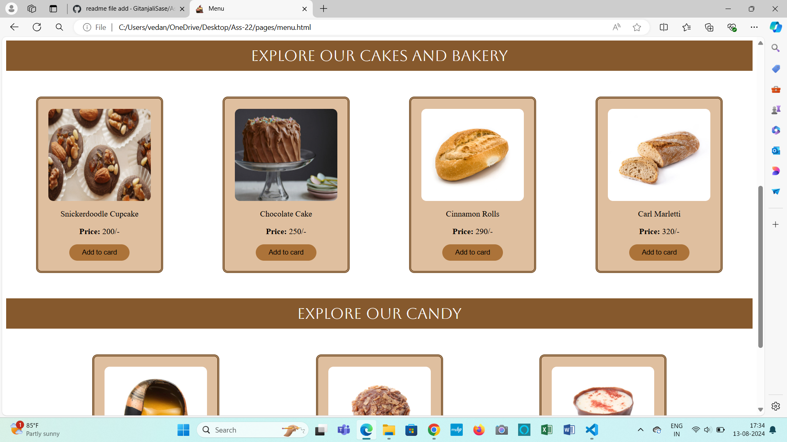

# Sweet Delights
## Project Overview 
Welcome to Sweet Delights
Sweet Delights is an e-commerce website showcasing a variety of sweet treats, including chocolates, candies, cakes, and bakery products.
 The website features menu categories, an About Us page sharing the shop's story, a Contact page for customer inquiries, and a Location page displaying the physical shop location with a user-friendly interface. 
Sweet Delights aims to provide a delightful online shopping experience, encouraging customers to explore and indulge in their sweet cravings.
 
## Objectives
Plan to achieve by the end of project.

- Showcase a wide variety of sweet treats and products to customers.
- Provide a user-friendly online shopping experience.
- Share information about the shop, its mission, and values.
- Encourage customers to contact and visit the physical location.
- Increase sales and revenue through online orders and in-store visits.
- Build a community of loyal customers and sweet lovers.
- Establish Sweet Delights as a reputable and trustworthy online sweet shop.

[Home Page Screenshot]

[Menu Page Screenshot]

[ Visit to website ]https://sweetdelight.netlify.app